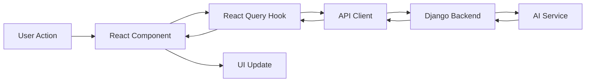

### Token Management
```typescript
// ✅ Secure token storage
// Option 1: httpOnly cookies (preferred)
// Option 2: localStorage with XSS protection

// Refresh token logic
const refreshToken = async () => {
  const { data } = await apiClient.post('/auth/refresh')
  localStorage.setItem('auth_token', data.token)
  return data.token
}
```

---

## 📦 Deployment Checklist

### Pre-Deployment
- [ ] Environment variables configured
- [ ] API endpoints updated for production
- [ ] Build optimization verified
- [ ] Error tracking setup (Sentry)
- [ ] Analytics setup (optional)
- [ ] SEO meta tags added
- [ ] Favicon and app icons

### Recommended Hosting
**Frontend:** Vercel (recommended for Next.js)
- Automatic deployments from Git
- Edge network
- Preview deployments
- Zero configuration

**Alternatives:**
- Netlify
- Railway
- AWS Amplify

### Build Configuration
```javascript
// next.config.js
module.exports = {
  reactStrictMode: true,
  images: {
    domains: ['your-api-domain.com'],
  },
  env: {
    NEXT_PUBLIC_API_URL: process.env.NEXT_PUBLIC_API_URL,
  },
}
```

---

## 🧪 Testing Strategy

### Unit Testing (Optional for MVP)
```bash
npm install --save-dev @testing-library/react @testing-library/jest-dom vitest
```

### E2E Testing (Post-MVP)
```bash
npm install --save-dev @playwright/test
```

### Manual Testing Checklist
- [ ] Login/logout flow
- [ ] Grant discovery and filtering
- [ ] Drag and drop on Kanban
- [ ] AI proposal generation
- [ ] Proposal editing and saving
- [ ] Dark mode toggle
- [ ] Responsive design (desktop, tablet)
- [ ] Error states
- [ ] Loading states
- [ ] Empty states

---

## 📚 Key Dependencies

### Production Dependencies
```json
{
  "dependencies": {
    "next": "^14.0.0",
    "react": "^18.2.0",
    "react-dom": "^18.2.0",
    "typescript": "^5.0.0",
    "@tanstack/react-query": "^5.0.0",
    "axios": "^1.6.0",
    "zustand": "^4.4.0",
    "@dnd-kit/core": "^6.1.0",
    "@dnd-kit/sortable": "^8.0.0",
    "@tiptap/react": "^2.1.0",
    "@tiptap/starter-kit": "^2.1.0",
    "framer-motion": "^10.16.0",
    "recharts": "^2.10.0",
    "tailwindcss": "^3.4.0",
    "class-variance-authority": "^0.7.0",
    "clsx": "^2.0.0",
    "tailwind-merge": "^2.0.0",
    "lucide-react": "^0.294.0",
    "next-themes": "^0.2.1",
    "date-fns": "^3.0.0",
    "zod": "^3.22.0",
    "react-hook-form": "^7.48.0"
  }
}
```

### Development Dependencies
```json
{
  "devDependencies": {
    "@types/node": "^20.0.0",
    "@types/react": "^18.2.0",
    "@types/react-dom": "^18.2.0",
    "eslint": "^8.54.0",
    "eslint-config-next": "^14.0.0",
    "prettier": "^3.1.0",
    "prettier-plugin-tailwindcss": "^0.5.0",
    "autoprefixer": "^10.4.0",
    "postcss": "^8.4.0"
  }
}
```

---

## 🎯 Success Metrics

### Technical Metrics
- **Performance:** Lighthouse score > 90
- **Accessibility:** WCAG 2.1 AA compliance
- **Bundle Size:** < 300KB initial load
- **Time to Interactive:** < 3 seconds

### User Experience Metrics
- **AI Generation Time:** < 10 seconds
- **Kanban Drag Smoothness:** 60fps
- **Search Response Time:** < 500ms
- **Auto-save Frequency:** Every 2 seconds

### Business Metrics
- **User Onboarding:** < 5 minutes to first proposal
- **Grant Matching Accuracy:** > 80% relevance
- **Proposal Quality:** Meets grant requirements
- **User Satisfaction:** Positive feedback on AI assistance

---

## 🚨 Common Pitfalls to Avoid

### 1. Over-Engineering
❌ **Don't:** Build complex microservices architecture  
✅ **Do:** Start with modular monolith, scale later

### 2. Premature Optimization
❌ **Don't:** Optimize before measuring  
✅ **Do:** Build features first, optimize bottlenecks

### 3. AI Integration
❌ **Don't:** Make AI feel like a chatbot  
✅ **Do:** Integrate AI contextually into workflows

### 4. Design Consistency
❌ **Don't:** Mix multiple design systems  
✅ **Do:** Stick to shadcn/ui + Tailwind conventions

### 5. State Management
❌ **Don't:** Put everything in global state  
✅ **Do:** Use React Query for server state, Zustand for UI state

### 6. Mobile Development
❌ **Don't:** Spend excessive time on mobile for MVP  
✅ **Do:** Focus on desktop, ensure tablet works

### 7. Feature Creep
❌ **Don't:** Add every possible feature  
✅ **Do:** Focus on core workflow: discover → draft → submit

---

## 🎓 Learning Resources

### Next.js & React
- [Next.js Documentation](https://nextjs.org/docs)
- [React Documentation](https://react.dev)
- [TypeScript Handbook](https://www.typescriptlang.org/docs/)

### UI & Styling
- [Tailwind CSS Docs](https://tailwindcss.com/docs)
- [shadcn/ui Components](https://ui.shadcn.com)
- [Radix UI Primitives](https://www.radix-ui.com)

### State & Data
- [TanStack Query](https://tanstack.com/query/latest)
- [Zustand Guide](https://docs.pmnd.rs/zustand)

### Specialized
- [dnd-kit Documentation](https://docs.dndkit.com)
- [Tiptap Editor](https://tiptap.dev)
- [Framer Motion](https://www.framer.com/motion/)
- [Recharts Examples](https://recharts.org/en-US/examples)

---

## 🎬 Quick Start Guide

### 1. Initialize Project
```bash
npx create-next-app@latest grantbridge-frontend --typescript --tailwind --app
cd grantbridge-frontend
```

### 2. Install Dependencies
```bash
npm install @tanstack/react-query axios zustand
npm install @dnd-kit/core @dnd-kit/sortable @dnd-kit/utilities
npm install framer-motion recharts
npm install @tiptap/react @tiptap/starter-kit
npm install next-themes date-fns
npm install lucide-react
npm install react-hook-form zod @hookform/resolvers
```

### 3. Setup shadcn/ui
```bash
npx shadcn-ui@latest init
npx shadcn-ui@latest add button card input dialog dropdown-menu badge
npx shadcn-ui@latest add avatar separator tooltip tabs
```

### 4. Configure Environment
```bash
# .env.local
NEXT_PUBLIC_API_URL=http://localhost:8000/api/v1
```

### 5. Start Development
```bash
npm run dev
```

---

## 📋 Implementation Checklist

### Week 1: Foundation
- [ ] Project setup and configuration
- [ ] Design system implementation (colors, typography)
- [ ] Base layout (sidebar, topbar)
- [ ] Authentication flow
- [ ] API client setup
- [ ] React Query configuration

### Week 2: Core Features
- [ ] Kanban board with drag-and-drop
- [ ] Grant discovery and listing
- [ ] Grant detail view
- [ ] Match score visualization
- [ ] Dashboard with metrics
- [ ] Basic charts

### Week 3: AI Integration
- [ ] Proposal editor setup
- [ ] AI generation integration
- [ ] AI toolbar (rewrite, tone, expand)
- [ ] AI loading states
- [ ] Proposal auto-save
- [ ] Organization profile

### Week 4: Polish
- [ ] Animations and transitions
- [ ] Dark mode refinement
- [ ] Error handling
- [ ] Empty states
- [ ] Loading skeletons
- [ ] Responsive design
- [ ] Testing and bug fixes

---

## 🎯 MVP Feature Prioritization

### Must Have (Week 1-2)
1. Authentication
2. Kanban board
3. Grant cards with match scores
4. Basic proposal editor
5. Dashboard

### Should Have (Week 3)
1. AI proposal generation
2. AI editing tools
3. Grant search/filters
4. Analytics charts
5. Organization profile

### Nice to Have (Week 4)
1. Advanced animations
2. AI chat assistant
3. Export functionality
4. Notification system
5. Settings page

### Post-MVP
1. Collaboration features
2. Advanced permissions
3. Email notifications
4. Mobile app
5. Offline support

---

## 🔄 Integration with Backend

### API Endpoints Mapping

**Authentication:**
```
POST /api/v1/auth/login
POST /api/v1/auth/register
POST /api/v1/auth/refresh
```

**Organizations:**
```
GET    /api/v1/organizations/:id
PUT    /api/v1/organizations/:id
POST   /api/v1/organizations
```

**Grants:**
```
GET    /api/v1/grants
GET    /api/v1/grants/:id
POST   /api/v1/grants/search
```

**Matching:**
```
POST   /api/v1/matching
GET    /api/v1/matching/:organizationId
```

**Proposals:**
```
GET    /api/v1/proposals
GET    /api/v1/proposals/:id
POST   /api/v1/proposals
PUT    /api/v1/proposals/:id
DELETE /api/v1/proposals/:id
```

**AI:**
```
POST   /api/v1/ai/generate-proposal
POST   /api/v1/ai/improve-text
POST   /api/v1/ai/rewrite
POST   /api/v1/ai/adjust-tone
```

### Data Flow Example



---

## 🎨 Design Inspiration Gallery

### Recommended UI References

**Kanban Boards:**
- Linear (https://linear.app)
- Monday.com
- Trello

**Proposal Editors:**
- Notion
- Google Docs
- Coda

**Dashboards:**
- Airtable
- Retool
- Metabase

**AI Interfaces:**
- ChatGPT
- Notion AI
- Jasper

**Overall SaaS Design:**
- Vercel Dashboard
- Railway
- Supabase

---

## 🏁 Final Recommendations

### For Hackathon Success

1. **Focus on Core Workflow**
   - Grant discovery → Kanban → Proposal generation
   - Don't get distracted by secondary features

2. **Prioritize Visual Polish**
   - First impressions matter in demos
   - Smooth animations and transitions
   - Beautiful AI loading states

3. **Emphasize AI Integration**
   - Make AI feel magical, not gimmicky
   - Contextual, helpful, integrated
   - Clear value proposition

4. **Keep It Simple**
   - Don't over-engineer
   - Use proven libraries
   - Focus on user experience

5. **Plan for Demo**
   - Prepare sample data
   - Practice user flow
   - Have backup plans

### Post-Hackathon Roadmap

**Phase 1: User Feedback (Week 1-2)**
- Gather user feedback
- Identify pain points
- Prioritize improvements

**Phase 2: Refinement (Week 3-4)**
- Fix critical bugs
- Improve AI quality
- Enhance UX based on feedback

**Phase 3: Scale (Month 2)**
- Add collaboration features
- Implement advanced permissions
- Optimize performance

**Phase 4: Growth (Month 3+)**
- Mobile app
- API integrations
- Advanced analytics
- Enterprise features

---

## 📞 Support & Resources

### Community
- Next.js Discord
- React Discord
- Tailwind CSS Discord
- shadcn/ui GitHub Discussions

### Documentation
- This roadmap (living document)
- Component documentation (to be created)
- API documentation (from backend team)

### Tools
- Figma (design mockups)
- Linear (project management)
- GitHub (version control)
- Vercel (deployment)

---

## ✅ Definition of Done

A feature is considered complete when:

1. **Functionality**
   - ✅ Works as specified
   - ✅ Handles edge cases
   - ✅ Error states implemented

2. **Design**
   - ✅ Matches design system
   - ✅ Responsive (desktop + tablet)
   - ✅ Dark mode supported

3. **Code Quality**
   - ✅ TypeScript types defined
   - ✅ No console errors
   - ✅ Follows project conventions

4. **Integration**
   - ✅ API integration working
   - ✅ Loading states implemented
   - ✅ Error handling in place

5. **Polish**
   - ✅ Animations smooth
   - ✅ Accessible (keyboard navigation)
   - ✅ Performance optimized

---

## 🎉 Conclusion

This roadmap provides a comprehensive guide to building a modern, AI-powered grant management platform. The key to success is:

1. **Start with the foundation** - Get the basics right
2. **Focus on core features** - Kanban, AI, proposals
3. **Polish the experience** - Smooth, beautiful, intelligent
4. **Iterate based on feedback** - Continuous improvement

Remember: The goal is to create a platform that feels like **"A modern AI productivity platform for nonprofits"**, not **"A hackathon prototype with AI glued on top."**

Good luck building! 🚀

---

**Document Version:** 1.0  
**Last Updated:** 2026-05-02  
**Maintained By:** Development Team  
**Status:** Living Document
